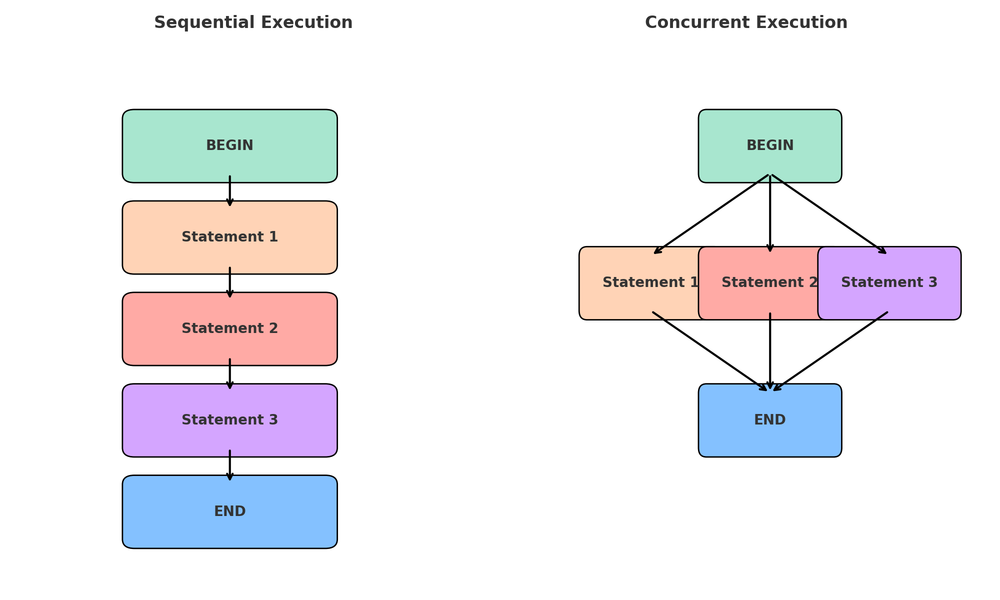

# Sequential vs Concurrent Execution

Understanding the difference between **sequential** and **concurrent** execution is critical in programming and computer science.

---



## 🔹 Sequential Execution
- Instructions are executed **one after another**.
- Each step must **wait until the previous one finishes**.
- This is simpler, predictable, but can be **slower** when tasks could otherwise run in parallel.

**Example (Sequential):**
```python
print("Task 1")
print("Task 2")
print("Task 3")
```
➡️ Output will always be in order: Task 1 → Task 2 → Task 3.

---

## 🔹 Concurrent Execution
- Multiple instructions or tasks are executed **at the same time (or overlapping in time)**.
- Tasks can run **independently**, but they may share resources.
- Concurrency improves **performance** when tasks are independent.

**Example (Concurrent using threads):**
```python
import threading

def task(name):
    print(f"{name} is running")

t1 = threading.Thread(target=task, args=("Task 1",))
t2 = threading.Thread(target=task, args=("Task 2",))
t3 = threading.Thread(target=task, args=("Task 3",))

t1.start()
t2.start()
t3.start()

t1.join()
t2.join()
t3.join()
```
➡️ Output order may vary because tasks run **concurrently**.

---

## 📊 Visual Comparison


- **Left (Sequential):** Steps go one after another in a straight line.
- **Right (Concurrent):** Multiple steps branch out from BEGIN and later converge at END.

---

## ✅ Key Takeaways
- **Sequential** = one path, predictable, simple.
- **Concurrent** = multiple tasks overlap in execution, improving performance.
- Concurrency does **not always mean parallelism** (true parallelism requires multiple CPUs/cores).
