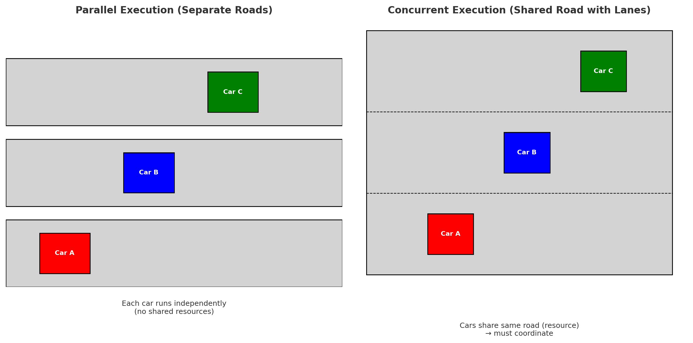

# Concurrent vs Parallel Programming

---



## 🔹 Concurrent Programming
- Multiple tasks **progress in overlapping time frames**.  
- They may share resources (e.g., threads share memory).  
- Not necessarily running at the same instant.  
- Analogy: **Cars at an intersection** → they all try to move forward, but some wait.  

---

## 🔹 Parallel Programming
- Tasks run **at exactly the same time**, truly simultaneous.  
- Achieved using multiple **CPU cores or processors**.  
- Best for **CPU-bound** tasks.  
- Analogy: **Cars on independent lanes** → all moving forward simultaneously.  

---

## 🔹 Example in Python

**Concurrent (Threads):**
```python
import threading

def task(name):
    print(f"{name} done")

threads = [threading.Thread(target=task, args=(f"Task {i}",)) for i in range(3)]

for t in threads: 
    t.start()
for t in threads: 
    t.join()
```

**Parallel (Processes):**
```python
from multiprocessing import Process

def task(name):
    print(f"{name} done")

processes = [Process(target=task, args=(f"Task {i}",)) for i in range(3)]

for p in processes: 
    p.start()
for p in processes: 
    p.join()
```

---

## 🔹 Key Differences

| Feature        | Concurrency | Parallelism |
|----------------|-------------|-------------|
| Execution      | Interleaved tasks | Simultaneous tasks |
| Resource Use   | Shared (threads/memory) | Independent (CPU cores) |
| Best for       | I/O-bound tasks | CPU-bound tasks |
| Analogy        | Cars at an intersection | Cars on different lanes |

---
