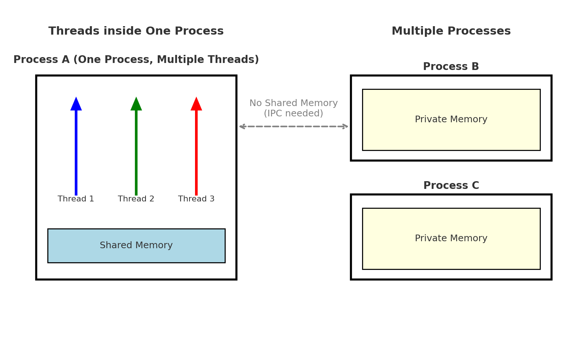

# Threads versus Processes

More than one thread can be implemented within the same process, most often executing concurrently and accessing/sharing the same resources, such as memory. Separate processes do not do this. Threads in the same process share the latter's instructions (its code) and context (the values that its variables reference at any given moment).

---

## Visual Representation


*Illustration of a process with multiple threads of execution running concurrently in the same memory space.*

---

## Key Difference
- A **thread** is typically a component of a process.  
- One process can include multiple threads, which can be executing simultaneously.  
- Threads usually allow for **shared resources** (memory and data).  
- Processes are **isolated** from each other and rarely share memory directly (need IPC – Inter-Process Communication).  

In short, a **thread** is an independent component of computation that is similar to a process, but the threads within a process can **share the address space**, and hence the data, of that process.


---

## Historical Note
Threads were reportedly first used for a variable number of tasks in **OS/360 multiprogramming**, a discontinued batch processing system developed by IBM in 1967.  
- At the time, threads were called **tasks** by developers.  
- The term **thread** became popular later on and is attributed to **Victor A. Vyssotsky**, a mathematician and computer scientist who was the founding director of Digital’s Cambridge Research Lab.

---

## Additional Insights
- **Threads vs Processes**
  - Threads: lightweight, fast to create, share memory.  
  - Processes: heavy, isolated, need IPC for communication.  

- **When to use Threads?**
  - When tasks share common memory/resources.  
  - When you want lightweight parallelism.  

- **When to use Processes?**
  - When you need isolation and reliability.  
  - When tasks should not share memory (e.g., sandboxing).  

---

## Python Perspective
- Python uses **`threading`** module for creating threads.  
- For processes, Python provides **`multiprocessing`** module.  

```python
# Example: Creating a thread in Python
import threading

def worker():
    print("Thread is running")

t = threading.Thread(target=worker)
t.start()
t.join()
```

```python
# Example: Creating a process in Python
from multiprocessing import Process

def worker():
    print("Process is running")

p = Process(target=worker)
p.start()
p.join()
```
